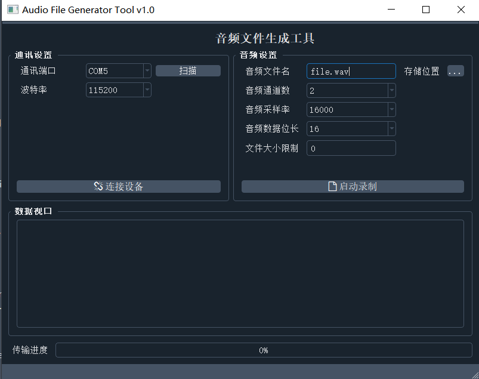

# Audio_File_Generator

通用PCM数据转wav文件生成器



## 原始数据发送模块

依赖两个文件：`Audio_Debug.c`和`Audio_Debug.h`

```c
/**                                                                             
 *  @file Audio_Debug.c                                                   
 *                                                                              
 *  @date 2021年09月28日 08:55:20 星期二
 *
 *  @author aron566
 *
 *  @copyright Copyright (c) 2021 aron566 <aron566@163.com>.
 *
 *  @brief 音频数据打包发送至上位机，由上位机合并成wav文件.
 *
 *  @details 1、发送区大小应至少满足：AUDIO_DEBUG_FRAME_STEREO_SIZE.
 *           2、发送音频至少为双通道，通过设置将某一通道数据复制到另一通道.
 *           3、最大支持8通道数据传输，发送缓冲区必须随之增大 8*AUDIO_DEBUG_FRAME_MONO_SIZE.
 *           4、数据格式：LEFT RIGHT LEFT RIGHT......
 *           5、多通道下数据格式：CH1 CH2 CH3 .... CH1 CH2 CH3 ....
 *
 *  @version V1.0
 */
/** Includes -----------------------------------------------------------------*/

/* Private includes ----------------------------------------------------------*/
#include "Audio_Debug.h"
#include "CircularQueue.h"

/** Use C compiler -----------------------------------------------------------*/
#ifdef __cplusplus ///< use C compiler
extern "C" {
#endif
/** Private typedef ----------------------------------------------------------*/
/*发送区音频*/
typedef struct 
{
  uint16_t *Send_Buf_Ptr;
  SEND_DATA_FUNC_PORT_Typedef_t Send_Audio_Data;
  GET_IDEL_STATE_PORT_Typedef_t Get_Idel_State;
}SEND_BUF_Typedef_t;
                                                     
/** Private macros -----------------------------------------------------------*/
#define AUDIO_DATA_BUF_SIZE (CHANNEL_NUMBER_MAX*AUDIO_DEBUG_FRAME_MONO_SIZE*2)/**< 环形缓冲区大小*/                                                                                 
/** Private constants --------------------------------------------------------*/
/** Public variables ---------------------------------------------------------*/
/** Private variables --------------------------------------------------------*/
/*音频缓冲区*/
static uint16_t Audio_Data_Buf[AUDIO_DATA_BUF_SIZE];
static CQ_handleTypeDef CQ_Audio_Data_Handle;

/*发送设置*/
static AUDIO_DEBUG_CHANNEL_SEL_Typedef_t Current_Channel_Sel = CHANNEL_2_EN;
static uint32_t Current_Send_Size = AUDIO_DEBUG_FRAME_STEREO_SIZE;
/*发送区*/
static SEND_BUF_Typedef_t Send_Region;
/** Private function prototypes ----------------------------------------------*/
                                                                                
/** Private user code --------------------------------------------------------*/
                                                                     
/** Private application code -------------------------------------------------*/
/*******************************************************************************
*                                                                               
*       Static code                                                             
*                                                                               
********************************************************************************
*/                                                                              
                                                                                
/** Public application code --------------------------------------------------*/
/*******************************************************************************
*                                                                               
*       Public code                                                             
*                                                                               
********************************************************************************
*/
/**
  ******************************************************************
  * @brief   音频调试通道使能
  * @param   [in]Ch_Sel 使能通道. 
  * @return  None.
  * @author  aron566
  * @version V1.0
  * @date    2021-09-28
  ******************************************************************
  */
void Audio_Debug_Channel_Sel(AUDIO_DEBUG_CHANNEL_SEL_Typedef_t Ch_Sel)
{
  Current_Channel_Sel = Ch_Sel;
  uint32_t Number = (uint32_t)Current_Channel_Sel > (uint32_t)CHANNEL_2_EN?(uint32_t)Current_Channel_Sel:(uint32_t)CHANNEL_2_EN;
  Current_Send_Size = Number * AUDIO_DEBUG_FRAME_MONO_SIZE;
  CQ_emptyData(&CQ_Audio_Data_Handle);
}

/**
  ******************************************************************
  * @brief   音频调试启动
  * @param   [in]None. 
  * @return  true 成功
  * @author  aron566
  * @version V1.0
  * @date    2021-09-28
  ******************************************************************
  */
bool Audio_Debug_Start(void)
{
  uint32_t Len = CQ_getLength(&CQ_Audio_Data_Handle);
  if(Len < Current_Send_Size)
  {
    return false;
  }
  if(Send_Region.Get_Idel_State() == false)
  {
    return false;
  }
  CQ_16getData(&CQ_Audio_Data_Handle, Send_Region.Send_Buf_Ptr, Current_Send_Size);
  Send_Region.Send_Audio_Data((uint8_t *)Send_Region.Send_Buf_Ptr);
  return true;
}

/**
  ******************************************************************
  * @brief   音频数据打包发送
  * @param   [in]Left_Audio_Data 左音频数据
  * @param   [in]Right_Audio_Data 右音频数据
  * @param   [in]Channel_Number 通道总数
  * @param   [in]... 其他通道数据
  * @return  None.
  * @author  aron566
  * @version V1.0
  * @date    2021-09-28
  ******************************************************************
  */
void Audio_Debug_Put_Data(const int16_t *Left_Audio_Data, const int16_t *Right_Audio_Data, uint8_t Channel_Number, ...)
{
  int16_t Audio_Data[Channel_Number*AUDIO_DEBUG_FRAME_MONO_SIZE];
  
  va_list args;
  
  uint32_t index = 0;
  for(uint32_t i = 0; i < AUDIO_DEBUG_FRAME_MONO_SIZE; i++)
  {
    switch(Current_Channel_Sel)
    {
      case CHANNEL_1_EN:
        Audio_Data[index++] = Left_Audio_Data[i];
        Audio_Data[index++] = Left_Audio_Data[i];
        break;
      case CHANNEL_2_EN:
        Audio_Data[index++] = Left_Audio_Data[i];
        Audio_Data[index++] = Right_Audio_Data[i];
        break;
      case CHANNEL_3_EN:
      case CHANNEL_4_EN:
      case CHANNEL_5_EN:
      case CHANNEL_6_EN:
      case CHANNEL_7_EN:
      case CHANNEL_8_EN:
      {
        Audio_Data[index++] = Left_Audio_Data[i];
        Audio_Data[index++] = Right_Audio_Data[i];
        
        /* args point to the first variable parameter */
        va_start(args, Channel_Number);
        for(uint8_t Channel_Index = 0; Channel_Index < Channel_Number; Channel_Index++)
        {
          Audio_Data[index++] = (va_arg(args, uint16_t *))[i];
        }
        break; 
      }                          
      case default:
        Audio_Data[index++] = 0;
        Audio_Data[index++] = 0;
        break;
    }
  }
  va_end(args);
  CQ_16putData(&CQ_Audio_Data_Handle, Audio_Data, AUDIO_DEBUG_FRAME_STEREO_SIZE);
}

/**
  ******************************************************************
  * @brief   音频调试初始化
  * @param   [in]Send_Buf.
  * @param   [in]Send_Data_Func 发送数据接口.
  * @param   [in]Get_Idel_Func 获取空闲状态.
  * @return  None.
  * @author  aron566
  * @version V1.0
  * @date    2021-09-28
  ******************************************************************
  */
void Audio_Debug_Init(uint16_t *Send_Buf, SEND_DATA_FUNC_PORT_Typedef_t Send_Data_Func, GET_IDEL_STATE_PORT_Typedef_t Get_Idel_Func)
{
  /*初始化发送区*/
  Send_Region.Send_Buf_Ptr = Send_Buf;
  Send_Region.Send_Audio_Data = Send_Data_Func;
  Send_Region.Get_Idel_State = Get_Idel_Func;

  /*初始化缓冲区*/
  CQ_16_init(&CQ_Audio_Data_Handle, Audio_Data_Buf, AUDIO_DATA_BUF_SIZE);
}
#ifdef __cplusplus ///<end extern c                                             
}                                                                               
#endif                                                                          
/******************************** End of file *********************************/

```

头文件

```c
/**                                                                             
 *  @file Audio_Debug.h                                                    
 *                                                                              
 *  @date 2021年09月28日 08:54:51 星期二
 *                                                                              
 *  @author Copyright (c) 2021 aron566 <aron566@163.com>.                       
 *                                                                              
 *  @brief None.                                                                
 *                                                                              
 *  @version V1.0                                                               
 */                                                                             
#ifndef AUDIO_DEBUG_H                                                          
#define AUDIO_DEBUG_H                                                          
/** Includes -----------------------------------------------------------------*/
#include <stdint.h> /**< need definition of uint8_t */                          
#include <stddef.h> /**< need definition of NULL    */                          
#include <stdbool.h>/**< need definition of BOOL    */                        
#include <stdio.h>  /**< if need printf             */                          
#include <stdlib.h>                                                             
#include <string.h>                                                             
#include <limits.h> /**< need variable max value    */ 
#include <stdarg.h>                         
/** Private includes ---------------------------------------------------------*/
#include "Algorithm_Port.h"/**< 内包含MONO_FRAME_SIZE定义的大小*/                                                                      
/** Use C compiler -----------------------------------------------------------*/
#ifdef __cplusplus ///< use C compiler                                          
extern "C" {                                                                  
#endif                                                                          
/** Private defines ----------------------------------------------------------*/
                                                                        
/** Exported typedefines -----------------------------------------------------*/
/*通道使能*/
typedef enum
{
  CHANNEL_0_NONE = 0,
  CHANNEL_1_EN,
  CHANNEL_2_EN,
  CHANNEL_3_EN,
  CHANNEL_4_EN,
  CHANNEL_5_EN,
  CHANNEL_6_EN,
  CHANNEL_7_EN,
  CHANNEL_8_EN,
  CHANNEL_NUMBER_MAX
}AUDIO_DEBUG_CHANNEL_SEL_Typedef_t;

typedef uint32_t (*SEND_DATA_FUNC_PORT_Typedef_t)(uint8_t *, uint32_t);
typedef bool (*GET_IDEL_STATE_PORT_Typedef_t)(void);
/** Exported constants -------------------------------------------------------*/
                                                                                
/** Exported macros-----------------------------------------------------------*/
#define AUDIO_DEBUG_FRAME_MONO_SIZE   MONO_FRAME_SIZE   /**< 单通道数据每帧点数*/
#define AUDIO_DEBUG_FRAME_STEREO_SIZE STEREO_FRAME_SIZE /**< 双通道数据每帧点数*/
/** Exported variables -------------------------------------------------------*/
/** Exported functions prototypes --------------------------------------------*/

/*音频调试初始化*/
void Audio_Debug_Init(uint16_t *Send_Buf, SEND_DATA_FUNC_PORT_Typedef_t Send_Data_Func, GET_IDEL_STATE_PORT_Typedef_t Get_Idel_Func);
/*音频调试启动*/
bool Audio_Debug_Start(void);
/*音频数据打包发送*/
void Audio_Debug_Put_Data(const int16_t *Left_Audio_Data, const int16_t *Right_Audio_Data, uint8_t Channel_Number, ...);
/*音频调试通道使能*/
void Audio_Debug_Channel_Sel(AUDIO_DEBUG_CHANNEL_SEL_Typedef_t Ch_Sel);

#ifdef __cplusplus ///<end extern c                                             
}                                                                               
#endif                                                                          
#endif                                                                          
/******************************** End of file *********************************/

```

## 使用方式

```c
static uint32_t SEND_DATA_FUNC_PORT(uint8_t *, uint32_t len)
{
  /*调用串口发送*/
}
static bool GET_IDEL_STATE_PORT(void)
{
  /*返回串口空闲状态*/
  return true;
}

/*定义发送区大小*/
static int16_t Send_Buf[128*4];/**< 4通道数据*/

int main(void)
{
  /*初始化硬件,时钟，串口，音频接收等*/
  ...
    
  /*初始化模块*/
  Audio_Debug_Init((uint16_t *)Send_Buf, SEND_DATA_FUNC_PORT, GET_IDEL_STATE_PORT);
  
  for(;;)
  {
    /*接收到音频数据*/
    if(Audio_Data_Is_Received == true)
    {
      /*调用算法处理音频*/
      Result_Audio_Data_Ptr = Algorithm_Func(Source_Audio_Data);
      
      /*数据给调试模块输出*/
      Audio_Debug_Put_Data(Source_Audio_Data, Result_Audio_Data_Ptr, 0);
    }
    /*依据音频周期，调用模块*/
    if(Can_Send_Flag == true)
    {
    	Audio_Debug_Start();
    }
  }
}
```

## 数据生成工具使用

